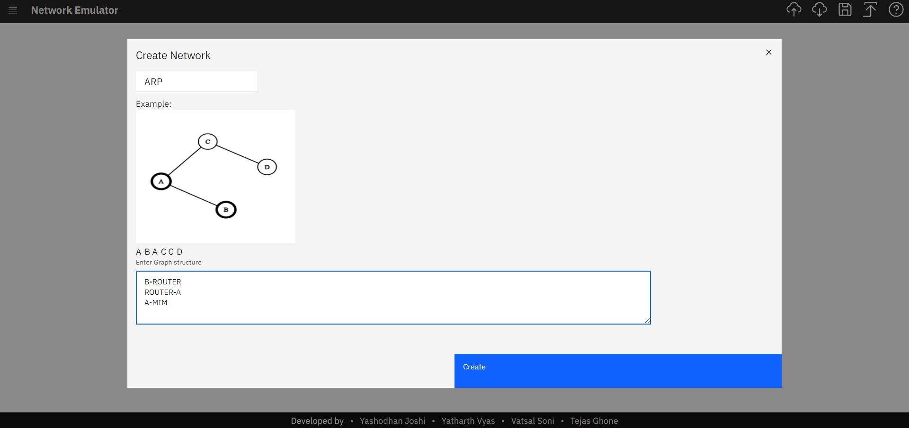
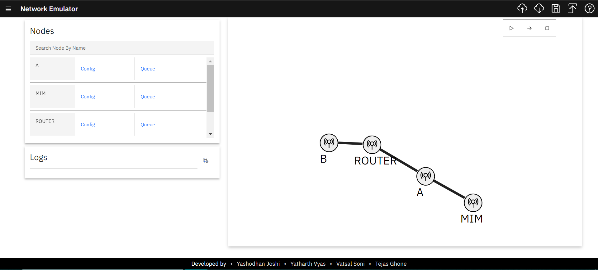
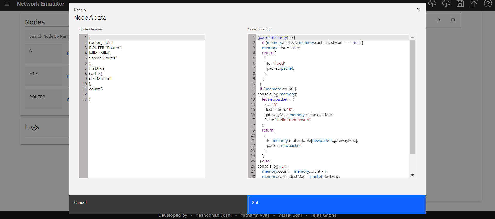
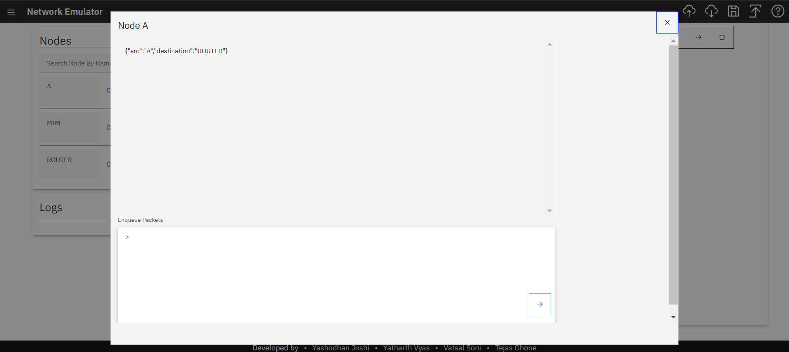
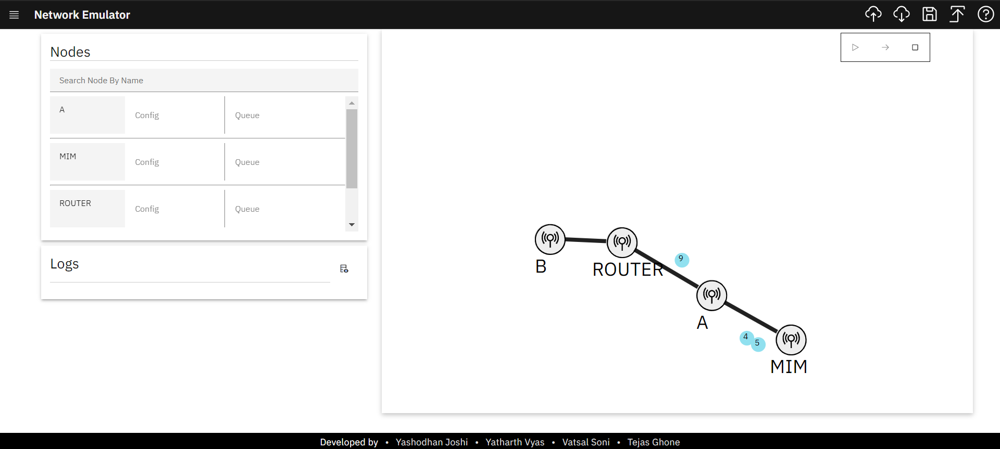
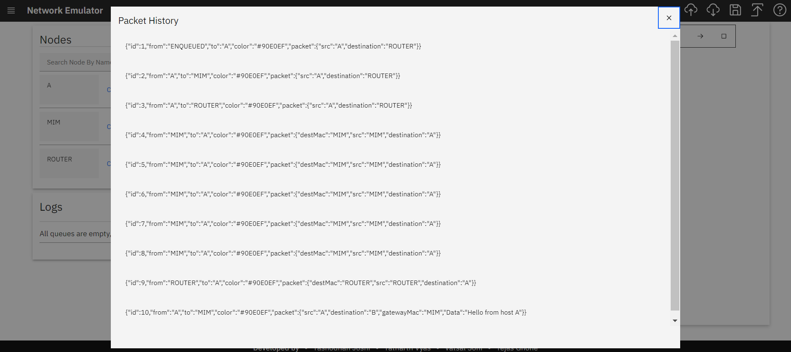

# Network Simulator

A simple Network simulator.

## What is it

This is a simple in browser network simulator, which can be used to visualize network graph and run specific logic code on packets. The main purpose of this is to simulate the packet transmission, where as implementation of logic and memory of any given node is left to user, which means that this can be used to simulate any network algorithm which can be coded using Javascript.

## How to use it

### step 1) Input the graph structure and name of project, click Create and graph will be drawn

### step 2) Add memory and function also enquue packets for respective nodes

### step 3) Click on play button on top right to start the animation and check logs.

### step 4) You can view the entire packet history of network

## Licence

Licensed under either of

    Apache License, Version 2.0 (LICENSE-APACHE or http://www.apache.org/licenses/LICENSE-2.0)
    MIT license (LICENSE-MIT or http://opensource.org/licenses/MIT)

at your option.

## Contribution

Unless you explicitly state otherwise, any contribution intentionally submitted for inclusion in the work by you, as defined in the Apache-2.0 license, shall be dual licensed as above, without any additional terms or conditions.
